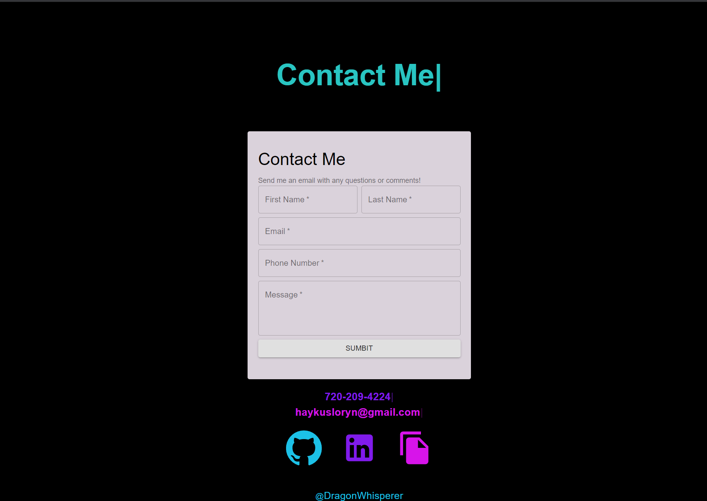
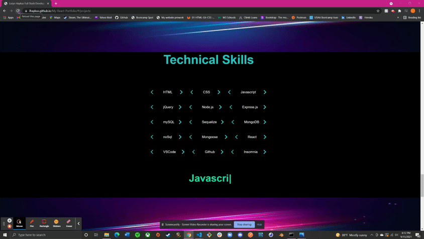
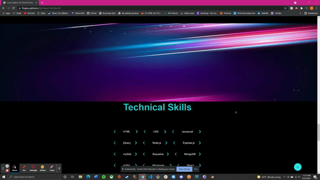

# <h1 align='center'>My Portfolio</h1>

Welcome to my updated portfolio! Using React and Material UI this portfolio will be used to show off my projects, skills and let people know more about me!

## Deployed App

https://lhaykus.github.io/My-React-Portfolio/#/

(Artwork for header image created by and credited to [Hybridgothic](https://twitter.com/Hybridgothica))

- [Description](#description)
- [Built With](#built-with)
- [App View](#app-view)
- [Future Developments](#future-developments)
- [Credits](#credits)

## Description
I used React and Material UI to build a responsive, unique, interactive portfolio to showcase my coding projects! 
## Features

- [X]  **React Parallax** was used to create a fun background that 'moves' when scrolling
- [X]  **React Typed** was used to create a fun animation for text that makes words look like they are being typed and erased on the page.
- [X] **React Card Flip**  was used for my project page. The front side is a picture of the app with some deployment links and the title. When you click the 'Click for more info' button, the card is turned around to the other side that has a decription of the app and a GIF of the app being used.
- [X] **Scroll Button** - when a user scrolls down from the top of the page a little blue circle appears that takes users back to top of page when clicked.
- [X] **Responsive Navbar** - The navbar changes into a menu icon when screen sizes decrease.

## Built With

*  React 
    *  React Parallax 
    *  React Typed 
    *  React Card Flip 
*  Material UI 

## App View

Quick Walkthrough

Project Section with React Card flip animation and working links to Github and Deployed App

Contact Form

React Typed animation throught the app

Scroll Button to scroll back to top of page 

Responsive Navbar

## Future Developments

- [ ] To make the skills section and overall layout more mobile responsive
- [ ] To get Contact Form to function
- [ ] To create cool 3D effects 
- [ ] Get project cards to flip independently and not all together

## Credits
 * Artwork for header image created by and credited to [Hybridgothic](https://twitter.com/Hybridgothica)
* Creating Contact Form [video](https://www.youtube.com/watch?v=Lv3OhfcxjkA)
* Parallax [video](https://www.youtube.com/watch?v=QfLI4BoXglA)
* React Card Flip [article](https://iuliia-proskurnina.medium.com/how-to-integrate-flip-cards-into-react-app-eab089c4df34)
* Creating scroll button that scrolls to top of page when at middle/end [video](https://dev.to/ailuj876/scroll-to-top-back-to-top-react-and-materialui-4j3f)
* Responsive Navbar with MaterialUI and React [video](https://www.youtube.com/watch?v=6JSkAfNvY4M)